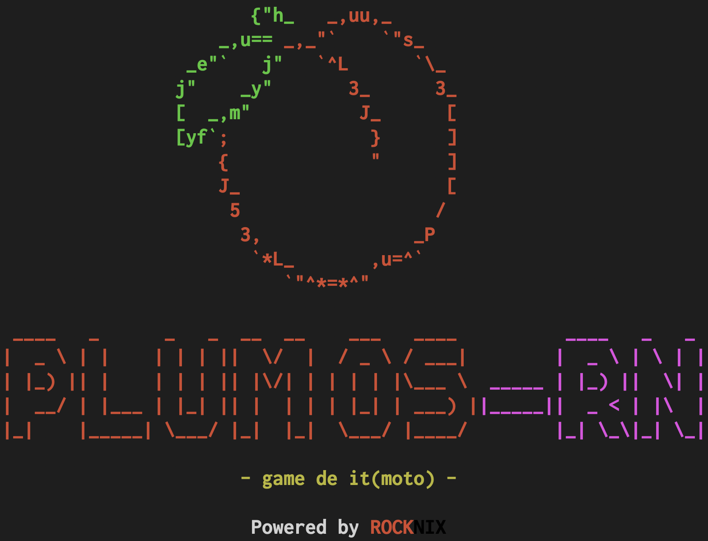

  

[Latest Version 2.0](https://github.com/game-de-it/plumOS-RN/releases/tag/20241121) 

---
# はじめに
[Click here for the English version of the explanation](./README_EN.md)

plumOS-RNはROCKNIXをフォークして作成されたOSです。  
ROCKNIXの基本的な機能を継承しており、それに少しだけ便利な機能を追加しています。  
ROCKNIXの偉大な開発チームおよび全てのオープンソースプロジェクトの皆様に多大なる感謝を申し上げます。  

## 対応機種
- Anbernic
  - RG353PS
  - RG353P
  - RG353VS
  - RG353V
  - RG503 
  - RG-ARC-S
  - RG-ARC-D (Androidを消す必要あり)

- Powkiddy
  - RGB20 Pro
  - X55
  - RK2023
  - RGB20SX
  - RGB30
  - RGB30r2 (後期に製造された機種)
  - RGB10MAX3

OSの基本的な機能や各デバイスの詳細は下記サイトから確認してください  
https://rocknix.org/

## ダウンロード
[「Releasesページ」からファイルをダウンロードできます](https://github.com/game-de-it/plumOS-RN/releases)

## 更新履歴
[NEW] ROCKNIX Ver 20241029をベースとしました  
[NEW] picoarchが利用可能  
[NEW] Powkiddy RGB20 ProとX55がサポート対象  
[NEW] Pyxelがオンラインアップデートに対応  

## 基本的な機能
- [pyxel](https://github.com/kitao/pyxel) が動作します
  - Emulationstationの`tools`セクションから`pyxel_update`を実行すると、pipとpyxelが最新バージョンにアップデートされます
  - コマンドラインでpythonパッケージをインストールする場合は`/storage/pyxel_Python/bin/pip3 install <パッケージ名>`
- イコライザー機能を搭載して音質を改善
  - Emulationstationの`tools`セクションから`Equalizer`を実行すると、Equalizerの機能をON/OFFできます  
(現在の状況がONなのかOFFなのかは、あえて表示していません)
- picoarchが利用可能
  - libretroコアによってはコントローラが効かないため、USBキーボードを利用してください(例えばfmsx)
  - 詳しくはpicoarchの仕様を参照してください

## 既知の問題
JELOSや旧plumOSのSD2スロットで利用していたSDカードと互換性があるかわかりません。  
特にportmasterは機種やOSによって仕様が異なるため動作しない可能性があります。  
バックアップをとってからお試しください。

## 将来対応させたい機能
- retroarchの動画録画機能を動作させる
- OTAアップデート(オフラインアップデートには対応しています)

## picoarchの仕様
- picoarchの利用方法
  - ROM選択画面でセレクトボタンを押して`ADVANCED SYSTEM OPTIONS`からエミュレータの選択をしてください
  

- picoarchのセーブデータの場所
  - セーブデータなどは`/storage/.config/.picoarch/data/`ディレクトリに保存されます。
  
- サポートしているlibretroコア

| libretroコア |  |
|:-------|-------:|
| beetle_wswan    |   gpsp  |   
|  dosbox_pure    |   mgba  | 
|  fmsx |   snes9x  |  
|   beetle-pce-fast  |   snes9x2010  |
|   quicknes  |   picodrive  | 
|   fceumm  |   gearsystem  | 
|  nestopia   |   msplus-gx  | 
|  gambatte   |  beetle_ngp   | 
|   pcsx_rearmed  | |

- picoarchのホットキー

| Button Combo | Action | 
|:-----------|------------:|
| SELECT+START     |      メニュー表示 |
| SELECT+R       |        ステートセーブ |
| SELECT+L     |      ステートロード |
| SELECT+R2     |      ファストフォワード(早送り) |
| SELECT+L2     |      FPS表示 |

- picoarchの解像度

| 名前 | 解像度 | 
|:-----------|------------:|
| picoarch_LD     |  320x240 |
| picoarch_HD       |  640x480 |
| picoarch_720     |   720x720 |
| picoarch_1024     |  1024x768 |

## Retroarchの仕様
- セーブファイルおよびステートセーブはromファイルと同じフォルダに作成されます(変更可能)
- RetroArchのホットキー
  - ※Hotkeyの設定は自由に変更可能です  

| Button Combo | Action | 
|:-----------|------------:|
| SELECT+B     |      Retroarchメニュー表示 |
| SELECT+R       |        ステートセーブ |
| SELECT+L     |      ステートロード |
| SELECT+R2     |      ファストフォワード(早送りx2倍) |
| SELECT+L2     |      スローモーション(x1.5倍) |
| SELECT+X     |      スナップショット(roms/screenshots) |
| SELECT+Y     |      FPS表示 |

## OSのホットキー
| Button Combo | Action | 
|:-----------|------------:|
| SELECT+Vol+       |        画面輝度を上げる |
| SELECT+Vol-       |        画面輝度を下げる |

---

## Licenses

**ROCKNIX** is a fork of [JELOS](https://jelos.org/), all licenses apply and credit to the JELOS team. 

You are free to:

- Share: copy and redistribute the material in any medium or format
- Adapt: remix, transform, and build upon the material

Under the following terms:

- Attribution: You must give appropriate credit, provide a link to the license, and indicate if changes were made. You may do so in any reasonable manner, but not in any way that suggests the licensor endorses you or your use.
- NonCommercial: You may not use the material for commercial purposes.
- ShareAlike: If you remix, transform, or build upon the material, you must distribute your contributions under the same license as the original.

### ROCKNIX Software

Copyright (C) 2024-present [ROCKNIX](https://github.com/ROCKNIX)

Original software and scripts developed by the ROCKNIX are licensed under the terms of the [GNU GPL Version 2](https://choosealicense.com/licenses/gpl-2.0/).  The full license can be found in this project's licenses folder.

### Bundled Works
All other software is provided under each component's respective license.  These licenses can be found in the software sources or in this project's licenses folder.  Modifications to bundled software and scripts by the JELOS team are licensed under the terms of the software being modified.

## Credits

Like any Linux distribution, this project is not the work of one person.  It is the work of many persons all over the world who have developed the open source bits without which this project could not exist.  Special thanks to CoreELEC, LibreELEC, JELOS, and to developers and contributors across the open source community.
