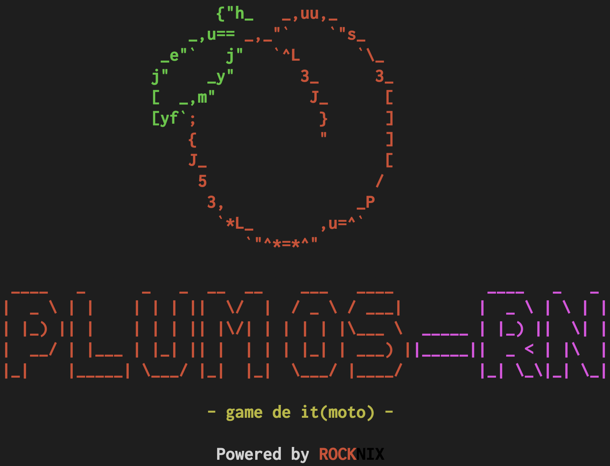

  

[Latest Version 2.0](https://github.com/game-de-it/plumOS-RN/releases/tag/20241121) 

---
# Introduction

plumOS-RN is an OS forked from ROCKNIX.  
It inherits the core functionality of ROCKNIX while adding a few convenient features.  
Special thanks to the ROCKNIX development team and all contributors to open-source projects for their tremendous efforts.  

## Supported Devices
- Anbernic
  - RG353PS
  - RG353P
  - RG353VS
  - RG353V
  - RG503 
  - RG-ARC-S
  - RG-ARC-D (Android must be removed)

- Powkiddy
  - RGB20 Pro
  - X55
  - RK2023
  - RGB20SX
  - RGB30
  - RGB30r2 (later-manufactured models)
  - RGB10MAX3

You can check the core functionality of the OS and details for each device on the website below:  
https://rocknix.org/

## Downloads
[Files can be downloaded from the "Releases" page](https://github.com/game-de-it/plumOS-RN/releases)

## Changelog
- [NEW] Based on ROCKNIX Ver 20241029  
- [NEW] picoarch is now available  
- [NEW] Added support for Powkiddy RGB20 Pro and X55  
- [NEW] Pyxel now supports online updates  

## Key Features
- **[pyxel](https://github.com/kitao/pyxel) compatibility**
  - Run `pyxel_update` from the `tools` section in Emulationstation to update pip and pyxel to the latest version.
- **Built-in equalizer to enhance audio quality**
  - Toggle the Equalizer on or off by running `Equalizer` from the `tools` section in Emulationstation.  
    (The current ON/OFF status is not displayed intentionally.)
- **picoarch compatibility**
  - Some libretro cores may not work with controllers; use a USB keyboard instead (e.g., fmsx).
  - Refer to picoarch documentation for details.

## Known Issues
- Compatibility with SD cards previously used in the SD2 slot of JELOS or older plumOS versions is uncertain.  
- Portmaster may not function properly due to differences in hardware or OS specifications.  
  Please ensure you have backups before testing.

## Features Planned for Future Releases
- Enable video recording in Retroarch  
- Implement OTA updates (offline updates are already supported)  

## picoarch Specifications
- **How to Use picoarch**
  - Press the Select button on the ROM selection screen and choose the emulator from `ADVANCED SYSTEM OPTIONS`.
  

- **Location of Save Data**
  - Save data is stored in the `/storage/.config/.picoarch/data/` directory.
  
- **Supported libretro cores**

| libretro Core |  |
|:-------|-------:|
| beetle_wswan    |   gpsp  |   
| dosbox_pure     |   mgba  | 
| fmsx            |   snes9x  |  
| beetle-pce-fast |   snes9x2010  |
| quicknes        |   picodrive  | 
| fceumm          |   gearsystem  | 
| nestopia        |   msplus-gx  | 
| gambatte        |  beetle_ngp   | 
| pcsx_rearmed    | |

- **picoarch Hotkeys**

| Button Combo    | Action                  | 
|:----------------|-------------------------:|
| SELECT+START    | Open  menu     |
| SELECT+R        | Save state              |
| SELECT+L        | Load state              |
| SELECT+R2       | Fast forward  |
| SELECT+L2       | Display FPS             |

- **picoarch Resolutions**

| Name           | Resolution | 
|:---------------|------------:|
| picoarch_LD    | 320x240     |
| picoarch_HD    | 640x480     |
| picoarch_720   | 720x720     |
| picoarch_1024  | 1024x768    |

## Retroarch Specifications
- Save files and state saves are created in the same folder as the ROM file (modifiable).
- **Retroarch Hotkeys**  
  (*Hotkey settings are customizable.*)

| Button Combo    | Action                    | 
|:----------------|---------------------------:|
| SELECT+B        | Open Retroarch menu       |
| SELECT+R        | Save state                |
| SELECT+L        | Load state                |
| SELECT+R2       | Fast forward (2x speed)   |
| SELECT+L2       | Slow motion (1.5x speed)  |
| SELECT+X        | Take snapshot (saved in `roms/screenshots`) |
| SELECT+Y        | Display FPS               |

## OS Hotkeys
| Button Combo   | Action                  | 
|:---------------|-------------------------:|
| SELECT+Vol+    | Increase screen brightness |
| SELECT+Vol-    | Decrease screen brightness |

---

## Licenses

**ROCKNIX** is a fork of [JELOS](https://jelos.org/), and all licenses apply, with credit given to the JELOS team. 

You are free to:

- **Share**: Copy and redistribute the material in any medium or format.
- **Adapt**: Remix, transform, and build upon the material.

Under the following terms:

- **Attribution**: Provide proper credit, a link to the license, and indicate changes made.  
- **NonCommercial**: You may not use the material for commercial purposes.  
- **ShareAlike**: Distribute contributions under the same license as the original.  

### ROCKNIX Software

Copyright (C) 2024-present [ROCKNIX](https://github.com/ROCKNIX)

Original software and scripts developed by ROCKNIX are licensed under the [GNU GPL Version 2](https://choosealicense.com/licenses/gpl-2.0/). Full license details are in this project's licenses folder.

### Bundled Works
All other software is provided under their respective licenses. These licenses can be found in the software sources or in this project's licenses folder. Modifications to bundled software and scripts by the JELOS team are licensed under the software's original terms.

## Credits

This project, like any Linux distribution, is a collective effort. Special thanks to CoreELEC, LibreELEC, JELOS, and developers and contributors from the open-source community.
